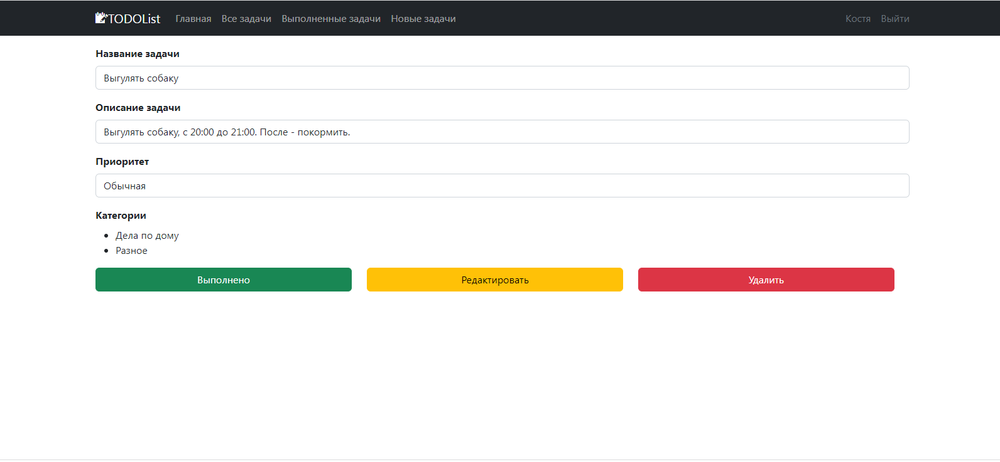
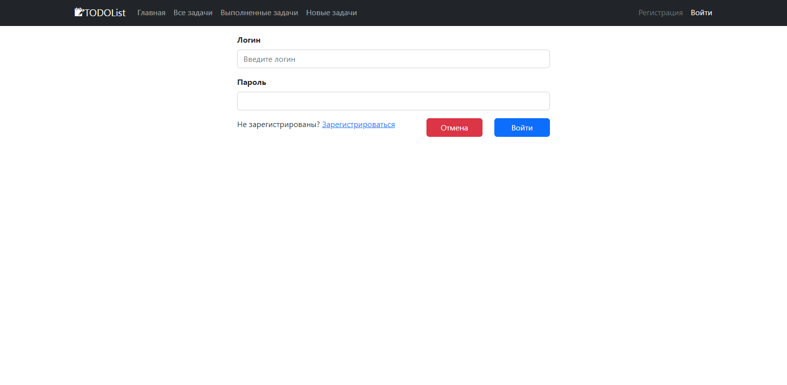
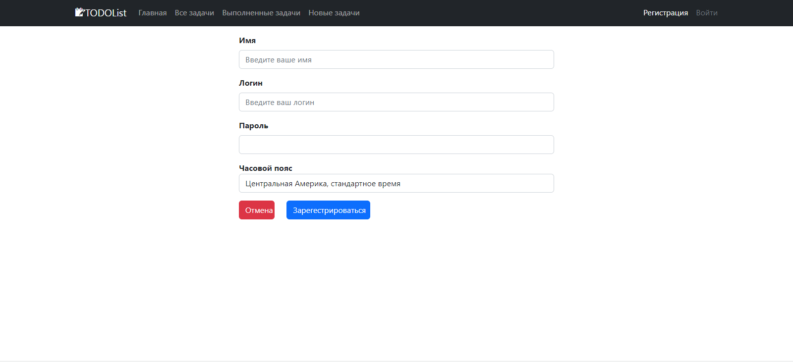

## Проект "TODOlist". Аналог ежедневника.


## Описание проекта:
#### Пользователь может (если он зарегистрирован), добавлять задания, помечать их как выполненные, 
удалять, редактировать.

## Стек технологий:
- Java 17
- Spring Boot Web, Test
- Thymeleaf
- Liquibase
- Maven 3.1.2.
- PostgreSQL 10
- H2
- lombok

## Требования к окружению:
- Java 17
- Maven версия не ниже 3.1.2
- PostgreSQL версия не ниже 10.

## Сборка и запуск:
- ___Cоздать базу данных___

 ```  
create database todo;
```
- ___Запустить проект по команде___
``` 
mvn spring-boot:run
```


## Взаимодействие с приложением:

**Список всех задач.**


**Внутри конкретной задачи.**


**Страница редактирования.**


**Страница входа.**


**Страница регистрации.**



### Контакты для связи: 
#### telegram - @avdeev_konst
