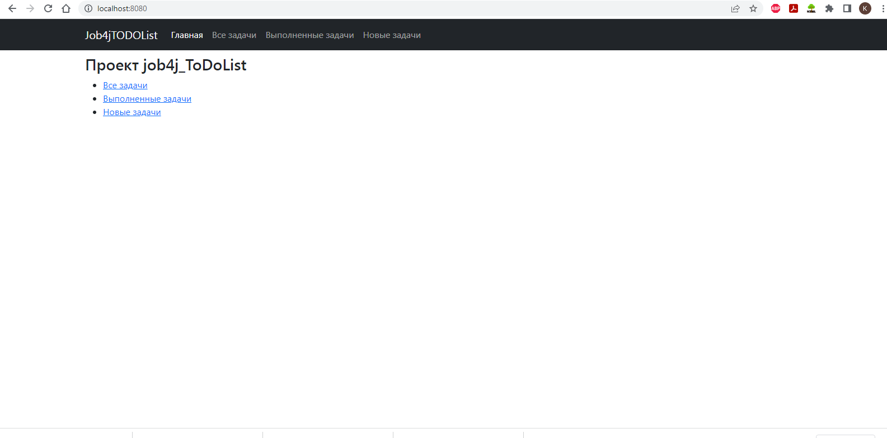
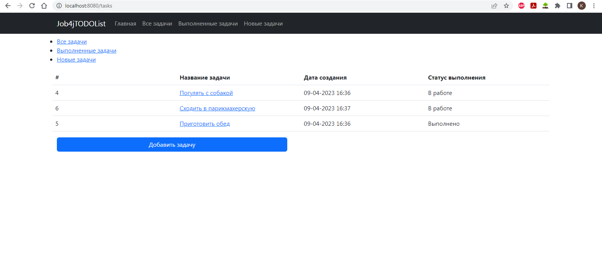
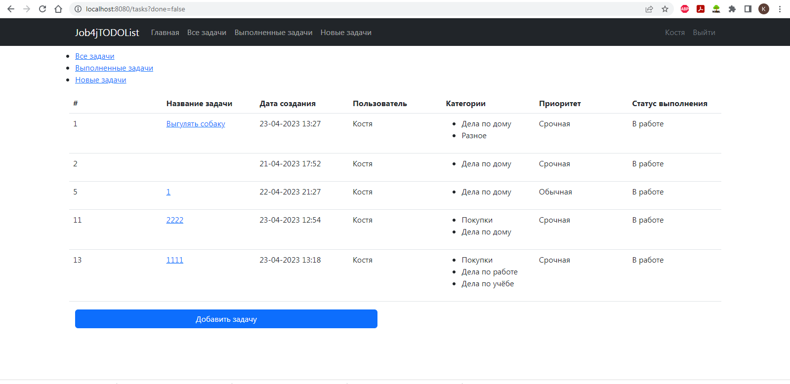
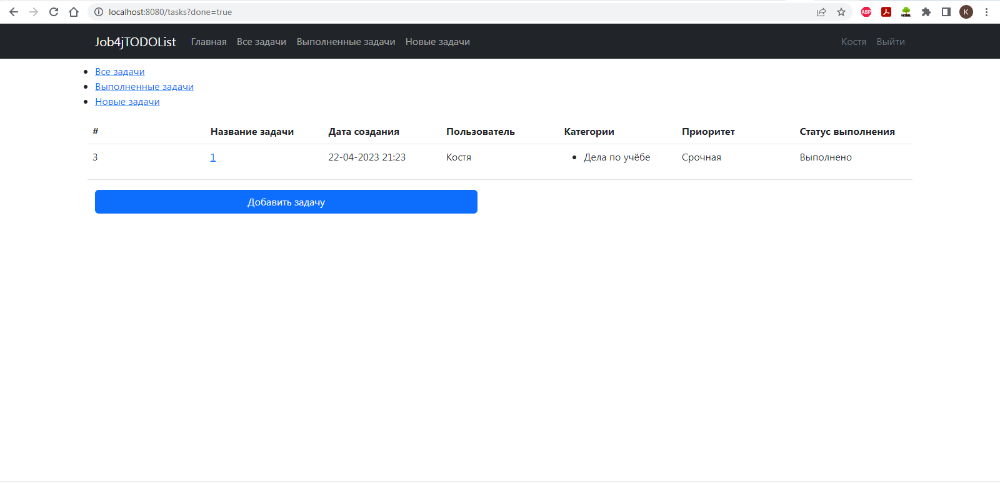
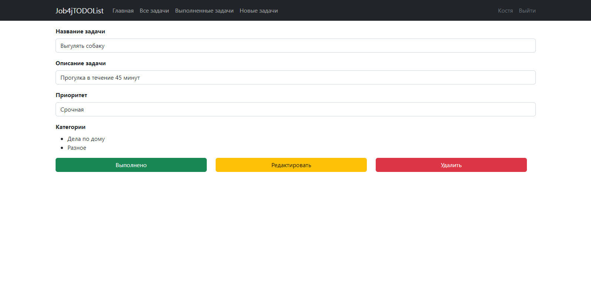
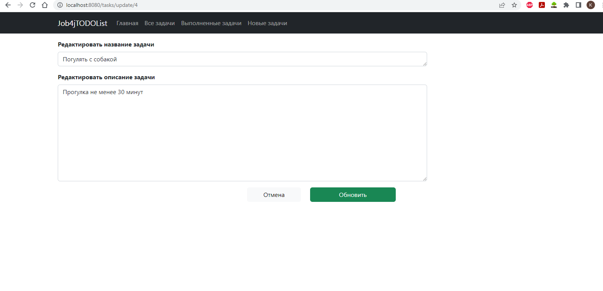

## Проект "todo_list".


## Описание проекта: 
#### Пользователь может добавлять в список новые задачи, удалять их, помечать как выполненные или наоборот, как новые.

## Стек технологий:
- Java 17
- Spring Boot version 2.7.6
- Thymeleaf
- Liquibase
- Maven 3.1.2.
- Sql2o version 1.6.0
- PostgreSQL 10
- H2
- jcip

## Требования к окружению:
- Java 17
- Maven версия не ниже 3.1.2
- PostgreSQL версия не ниже 10.

## Сборка и запуск:
- ___Cоздать базу данных___

 ```  
create database todo;
```
- ___Запустить проект по команде___
``` 
mvn spring-boot:run
```

## Взаимодействие с приложением:
**Главная страница.**


**Список всех задач.**


**Список новых задач(задач в работе).**


**Список выполненных задач.**


**Внутри конкретной задачи.**


**Страница редактирования.**


### Контакты для связи: 
#### telegram - @avdeev_konst
